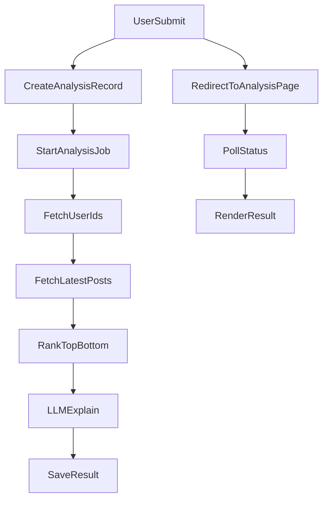

# Analysis URL + X/Anthropic Pipeline

## Goals

- On “Run analysis”, create a new analysis record, navigate to `/dashboard/analysis/[id]`, and render results from DB.
- Use `@xdevplatform/xdk` with `X_BEARER_TOKEN` to resolve usernames → IDs, fetch latest ~200 posts, rank top/bottom by engagement.
- Use Anthropic `claude-3-5-sonnet-20241022` to explain why top/bottom posts performed as they did.

## Plan

1. **Data model + migrations**

- Add an `analysis` table (e.g., id, userId, handles, status, result, error, createdAt/updatedAt) in a new schema file like [`src/db/analysis-schema.ts`](/Users/gauravvarma/code/orbit/src/db/analysis-schema.ts) and export it from [`src/db/schema.ts`](/Users/gauravvarma/code/orbit/src/db/schema.ts).
- Generate a migration with `drizzle-kit` and note that it must be applied before running analysis.

2. **Server-side analysis pipeline**

- Create a module like [`src/server/analysis.ts`](/Users/gauravvarma/code/orbit/src/server/analysis.ts) that:
    - Instantiates the X SDK client with `X_BEARER_TOKEN`.
    - Looks up user IDs by username, fetches up to 200 posts per user, and computes an engagement score from `public_metrics` (likes + replies + retweets + quotes).
    - Extracts simple post features (length, media/link/hashtag/mention counts, posting hour) and groups top/bottom 5 per user.
    - Calls Anthropic (`@anthropic-ai/sdk`) with model `claude-3-5-sonnet-20241022` to generate explanations from the summarized features.
    - Persists the final result JSON and marks status `complete` or `error`.

3. **API routes for create + read**

- Add [`src/app/api/analysis/route.ts`](/Users/gauravvarma/code/orbit/src/app/api/analysis/route.ts) (POST) to:
    - Validate handles, create the analysis record, kick off the async pipeline, and return the analysis id.
- Add `[src/app/api/analysis/[id]/route.ts](/Users/gauravvarma/code/orbit/src/app/api/analysis/[id]/route.ts)` (GET) to:
    - Return status/results, and optionally trigger compute if still pending.
- Secure both with `auth.api.getSession` so only signed-in users can create/read their analyses.

4. **Dashboard submit + analysis page**

- Update [`src/app/dashboard/page.tsx`](/Users/gauravvarma/code/orbit/src/app/dashboard/page.tsx) so the button POSTs to `/api/analysis`, then routes to `/dashboard/analysis/[id]`.
- Create `[src/app/dashboard/analysis/[id]/page.tsx](/Users/gauravvarma/code/orbit/src/app/dashboard/analysis/[id]/page.tsx)` (client component or wrapper) that polls `/api/analysis/[id]` until status is complete, then renders:
    - Per-user top 5 and bottom 5 posts with engagement metrics.
    - The Anthropic explanation comparing top vs bottom.

## Data flow

## Notes

- Dependencies to add: `@xdevplatform/xdk` and `@anthropic-ai/sdk`.
- Environment variables: `X_BEARER_TOKEN`, `ANTHROPIC_API_KEY`.

## Todos

- **schema-analysis**: Add analysis table and export schema
- **analysis-pipeline**: Implement X fetch + ranking + Anthropic explanation